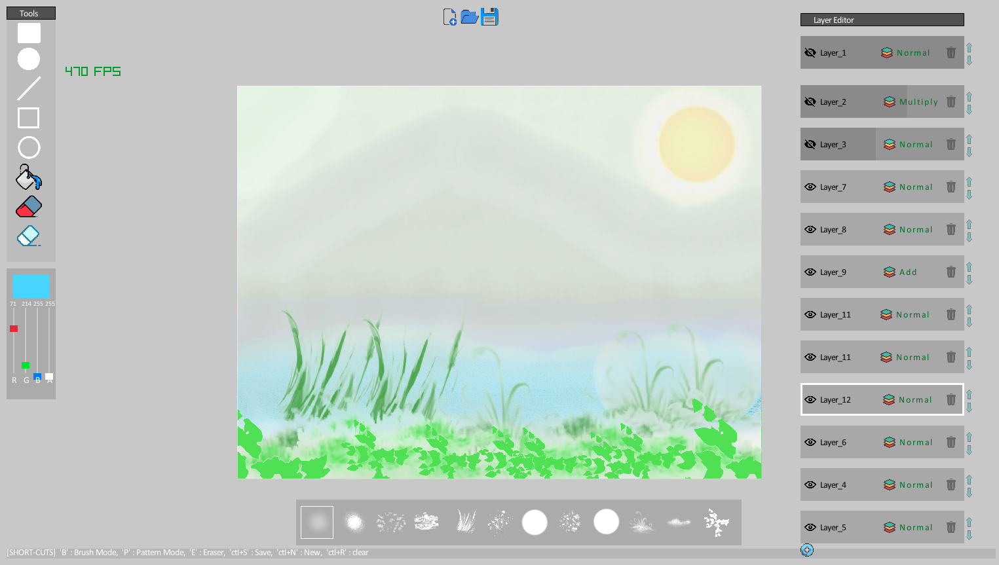

<h1 align="center"> Go-Canvas </H1>

<H2 align="center"> Drawing Application made from scratch in Go - lang using Raylib.</H2>

 Cross-Platform support (tested only on Windows)

-Features 
1. Pattern Brushes
2. Layers with Blending mode and opacity control.
3. Save and Open Project (WIP)
4. Import images to layers (WIP)
5. Export Image as PNG ("S" shortcut)
6. Merge layers ("WIP") 

- [NOTE] - Undo yet to implement!

!

<H2> How to Build </H2>

1. Clone or download the repo.

2. Open Terminal / command prompt from the project directory.

3. run "go run main.go" !

